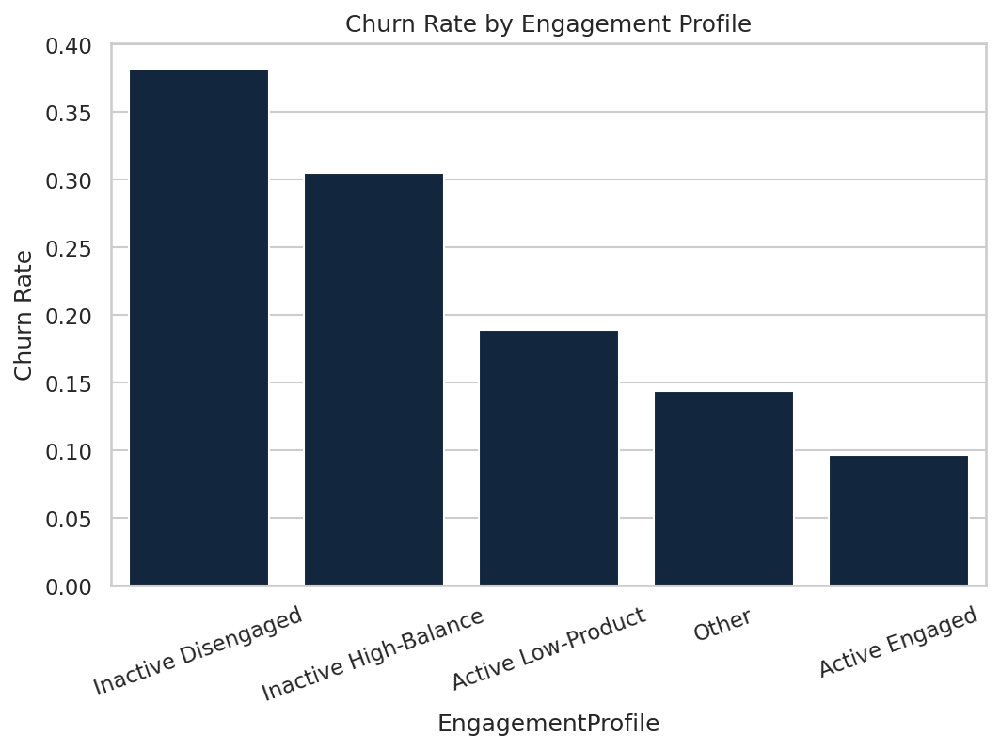
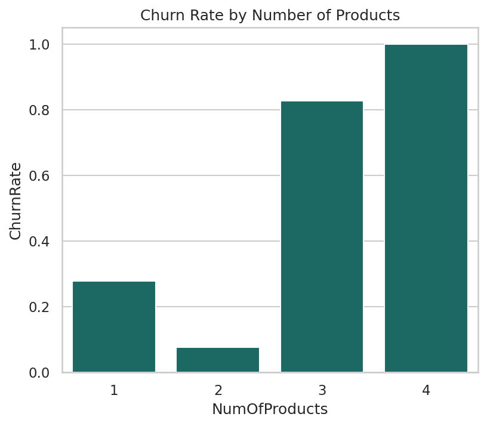
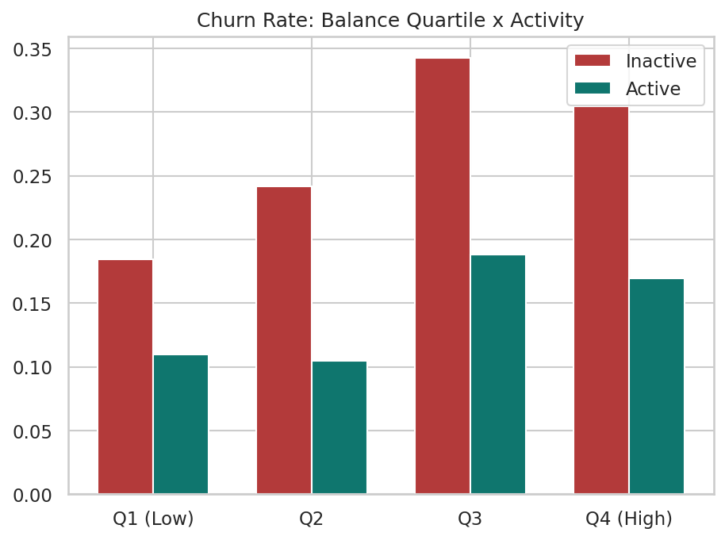
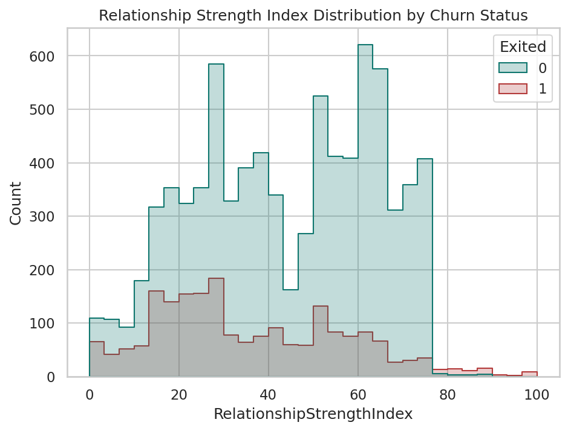
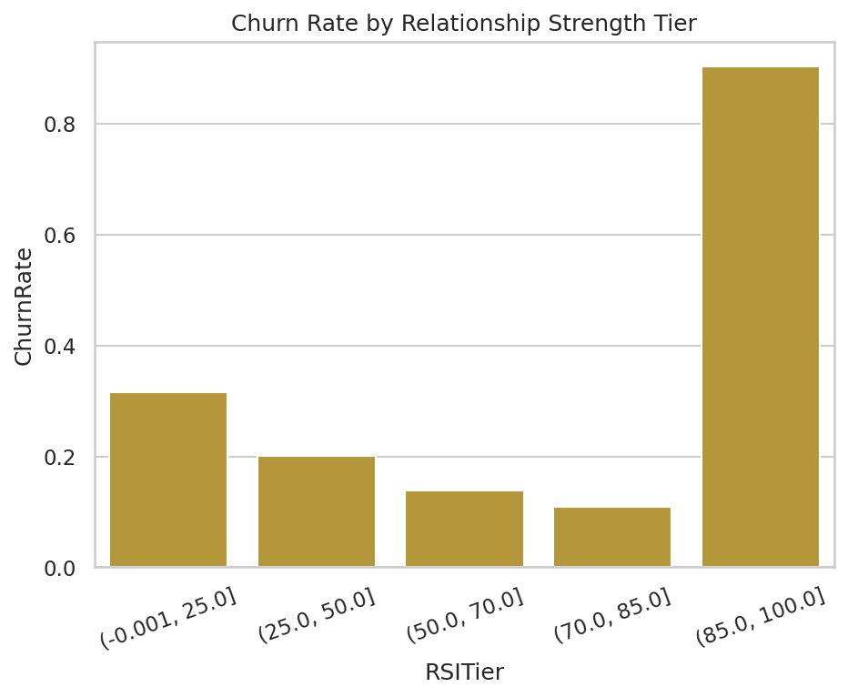

# Customer Engagement & Product Utilization Analytics for Retention Strategy

## Research Findings & Recommendations

## 1. Data Overview

- Rows analyzed: **10,000**
- Overall churn rate: **20.37%**
- Data validation status: **PASSED**
- Validation warnings: 1 (see data_loader validation report)

## 2. Engagement vs Churn

Active members churn at **14.27%**, compared to **26.85%** for inactive members — an Engagement Retention Ratio of **1.88x**. This confirms the project hypothesis: engagement, not just financial standing, is a primary driver of retention.

The highest-risk segment is **Inactive Disengaged**, with a churn rate of **38.22%** across 1,693 customers.

## 3. Product Utilization

Single-product customers churn at **27.71%** vs. **12.77%** for multi-product (2+) customers, a retention lift of **14.9 percentage points**. The Product Depth Index is **0.048** (positive = deeper product relationships associate with lower churn).

**Critical finding:** customers holding 3+ products churn at **85.9%**, far above the 2-product rate. This is not a marginal effect — it is a near-total loss of a small but distinct segment (326 customers), and warrants root-cause investigation (e.g. forced bundling, a failed cross-sell campaign, or a product-quality issue) rather than more aggressive selling of additional products.

**Credit Card Stickiness:** card holders churn +0.6 percentage points differently than non-holders (20.18% vs 20.81%).

## 4. Financial Commitment vs Engagement

Among top-quartile-balance customers, **49.9%** are inactive. This inactive-high-balance segment churns at **30.47%**, materially higher than the **16.92%** rate for active high-balance customers — direct evidence that balance alone does not protect against churn.

**2,154 customers** were flagged as at-risk premium customers (high balance and/or salary, but inactive) and are prioritized for proactive outreach.

## 5. Retention Strength Assessment

The average Relationship Strength Index (RSI) across the base is **42.3/100**. Churn drops off sharply once RSI crosses into higher tiers, identifying a practical engagement threshold banks can target through cross-sell and activation campaigns.

## 6. Recommendations

1. **Prioritize activation over acquisition.** Inactive members churn at 1.9x the rate of active members — reactivation campaigns likely deliver more retention value than new account growth.
2. **Bundle a second product deliberately, not indiscriminately.** Retention gains plateau (and can reverse) beyond 2 products; cross-sell strategy should target single-product customers specifically, not maximize product count broadly.
3. **Investigate the 3+ product segment immediately.** Near-total churn in this group is a red flag, not a marketing opportunity — likely candidates are a discontinued product bundle, a service failure, or forced enrollment; this should be a root-cause investigation before any retention campaign is designed for this segment.
4. **Build a silent-churn early-warning list.** The at-risk premium customer segment should feed directly into relationship-manager outreach queues, since these customers look healthy on financial metrics alone.
5. **Use the Relationship Strength Index as a scoring layer** in loyalty and retention workflows, since it aggregates activity, product depth, tenure, and card ownership into a single actionable number.
